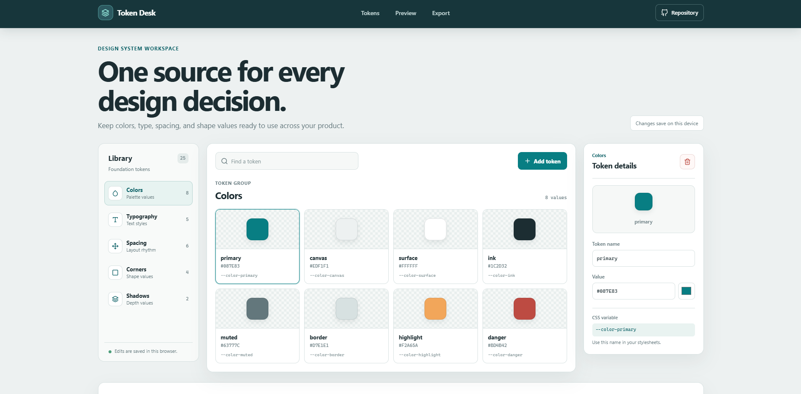

# Design Token Editor

Design Token Editor is a local-first workspace for creating and managing shared design values. It helps a designer or frontend developer keep a product's colors, text sizes, spacing, corner shapes, and shadows together, preview those values in a small interface, and export the set for use in a project.

**Live app:** [https://a2rp.github.io/design-token-editor/](https://a2rp.github.io/design-token-editor/)

## What is in the app

- A fixed header with smooth links to Tokens, Preview, and Export, plus a Repository link.
- A category rail for Colors, Typography, Spacing, Corners, and Shadows. Each category shows its current number of tokens.
- A searchable token board. Each card shows a visual sample, token name, value, and CSS variable name.
- A details panel for editing the selected token's name and value. Color values have a text field and a color picker.
- An Add token action in every category. New tokens receive a category-appropriate starting value and a unique default name.
- A custom confirmation dialog for deleting a token. Keep token, Escape, and clicking outside the dialog cancel the action.
- A live example card that updates when its linked color, type, spacing, corner, and shadow values change.
- Autosaving to this browser's local storage.
- CSS and JSON export views. Copy the current format or download it as a file.
- A footer with the shared profile logo, current-year copyright, profile links, support links, and the repository source link.
- A floating Back to top button after the page is scrolled more than 50px.
- Responsive layouts for desktop, tablet, and mobile widths.

## Using the token library

Choose a category in the left rail. Use **Find a token** to search the current category by name or value. Select a token card to open it in the details panel.

Select **Add token** to create a value in the current category. Edit its name or value in the details panel. Color tokens can be changed with the text input or the color picker. The sample card in Preview reflects the current values while you work. The editor links that sample to the original starter tokens, so renaming one of those tokens does not disconnect its value from the preview.

Select the trash icon in the details panel to remove a token. The confirmation dialog identifies the selected token. Choose **Keep token** or press Escape to cancel. Choose **Delete token** to confirm. If the last token in a category is removed, the board shows an empty state and you can add a replacement.

The application saves edits automatically in the current browser under the `design-token-editor-tokens` local storage key. Data is stored on this device and is not synced between browsers or accounts. Clearing the browser's site data removes the saved token set. If browser storage is unavailable, edits remain available for the current page session but cannot persist after it closes.

## Preview and export

The Preview section applies the starter color, typography, spacing, radius, and shadow tokens to an example product card. It updates as those token values change. The applied-value list shows a few of the values currently used by the card.

The Export section includes the full token set in two formats:

- **CSS** creates a `:root` block with custom properties such as `--color-primary` and `--space-4`.
- **JSON** creates an array of token records with their IDs, categories, names, values, and types.

Use **Copy code** to copy the visible format, or **Download file** to save it as `design-tokens.css` or `design-tokens.json`. If clipboard access is blocked, select and copy the code shown in the panel. These exports contain the current tokens; editing a downloaded file does not update the browser's saved copy.

## Run locally

Install Node.js, then run these commands from the project folder:

~~~sh
npm install
npm run dev
~~~

Open the local address printed by Vite.

## Lint, build, and deploy

~~~sh
npm run lint
npm run build
npm run deploy
~~~

ESLint is the project's linter. The deploy command runs the production build first, then publishes the `dist` folder to the `gh-pages` branch. GitHub Pages serves the app at [https://a2rp.github.io/design-token-editor/](https://a2rp.github.io/design-token-editor/). Vite uses `/design-token-editor/` as its base path. Do not commit the generated `dist` folder to `main`.

## Project files

- `src/components/siteHeader` contains the fixed responsive navigation.
- `src/components/tokenSidebar` and `src/components/tokenBoard` contain category and token browsing controls.
- `src/components/tokenInspector` contains token editing and its nested delete dialog.
- `src/components/systemPreview` renders the token-driven sample card.
- `src/components/exportPanel` creates and downloads CSS and JSON.
- `src/components/siteFooter` and `src/components/backToTop` contain the shared footer and page navigation control.
- `src/data/tokenGroups.js` contains the starter categories and values.
- `src/index.css` contains the reset and project color variables. Component appearance is kept beside its JSX in CSS modules.

## Future improvements

These are ideas for later work and are not implemented:

- Import a token set from a JSON file and validate its structure before replacing the current set.
- Add multiple named collections and switch between product themes.
- Add token references so one token can use another token as its value.
- Add contrast checks for color combinations and text sizes.
- Add more export targets for Sass, JavaScript, and design-tool formats.
- Add undo and redo for recent edits.

## Links

- Portfolio: [https://www.ashishranjan.net](https://www.ashishranjan.net)
- GitHub: [https://github.com/a2rp](https://github.com/a2rp)
- CodePen: [https://codepen.io/ash1198](https://codepen.io/ash1198)
- LinkedIn: [https://www.linkedin.com/in/aashishranjan](https://www.linkedin.com/in/aashishranjan)
- Facebook: [https://www.facebook.com/theash.ashish/](https://www.facebook.com/theash.ashish/)
- YouTube: [https://www.youtube.com/@ashishranjan-ashz?sub_confirmation=1](https://www.youtube.com/@ashishranjan-ashz?sub_confirmation=1)
- Email: [mailto:ash.ranjan09@gmail.com](mailto:ash.ranjan09@gmail.com)

## Support

- Support: [https://a2rp-donation-page.netlify.app/](https://a2rp-donation-page.netlify.app/)
- Buy Me a Coffee: [https://buymeacoffee.com/ashishranjan](https://buymeacoffee.com/ashishranjan)
- Patreon: [https://www.patreon.com/ashishranjan](https://www.patreon.com/ashishranjan)
